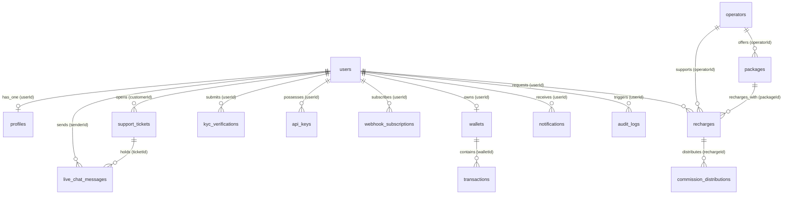

# RechargeSaaS Blueprint - Database ER Diagram and Relationship Mapping

This document provides a full-scale Entity Relationship (ER) overview, explaining the logical structure, data models, table indices, integrity constraints, and relationships for our multi-tier Telecom Recharge SaaS platform.

---

## 1. Mermaid Entity-Relationship Diagram

Below is the visual diagram in Mermaid.js format representing the complete schema structure, including primary keys, foreign keys, and cardinalities.

---

## 2. Table-by-Table Column Dictionary & Relationships

### A. Core Identity & Accounts
1. **`users` Table**
   - **`id`**: `UUID` (Primary Key).
   - **`email` / `phone`**: Unique identifiers, constrained for swift validation.
   - **`role`**: Enforced enum (`SUPER_ADMIN`, `ADMIN`, `MANAGER`, `DISTRIBUTOR`, `MASTER_DEALER`, `DEALER`, `RETAILER`, `AGENT`, `CUSTOMER`, `SUPPORT`, `FINANCE`).
   - **`kyc_status`**: Enforced enum tracking compliance status.
   - **`deleted_at`**: Nullable timestamp supporting safe soft deletes.
   - **Relationships**:
     - Has One profile, Has One wallet.
     - Has Many recharges, support tickets, notifications, and logs.

2. **`profiles` Table**
   - **`id`**: `UUID` (Primary Key).
   - **`user_id`**: `UUID` (Foreign Key referencing `users(id)`, cascading deletion, unique index constraint).
   - **`first_name` / `last_name` / `company_name`**: Personal metadata.

### B. Wallet, Balances & Ledger Ledger
3. **`wallets` Table**
   - **`id`**: `UUID` (Primary Key).
   - **`user_id`**: `UUID` (Foreign Key referencing `users(id)`, cascading deletion, unique).
   - **`main_balance`**: `DECIMAL(15, 4)` for general balance. High-precision decimal to avoid floating-point errors.
   - **`commission_balance`**: `DECIMAL(15, 4)` for commissions earned.
   - **`cashback_balance`**: `DECIMAL(15, 4)` for cashbacks/rewards.

4. **`transactions` Table (Immutable Double-Entry General Ledger)**
   - **`id`**: `UUID` (Primary Key).
   - **`wallet_id`**: `UUID` (Foreign Key referencing `wallets(id)`, cascading deletion).
   - **`type`**: Enum (`CREDIT`, `DEBIT`).
   - **`purpose`**: Enum (`RECHARGE`, `RECHARGE_COMMISSION`, `CASHBACK`, `WALLET_TRANSFER`, `TOPUP`, `REFUND`, `SYSTEM_ADJUSTMENT`).
   - **`amount` / `previous_balance` / `current_balance`**: Tracks the absolute balance progression, serving as an immutable record of movement.
   - **`reference_id`**: Reference UUID pointing to related model (e.g., specific Recharge ID or Transfer ID).

### C. Telco Catalog & Operations
5. **`operators` Table**
   - **`id`**: `UUID` (Primary Key).
   - **`name` / `code`**: Unique fields identifying telecom providers (e.g., "Grameenphone" with code "GP").
   - **`country_code`**: Country identifier.

6. **`packages` Table**
   - **`id`**: `UUID` (Primary Key).
   - **`operator_id`**: `UUID` (Foreign Key referencing `operators(id)`, cascading deletion).
   - **`name` / `type` / `price` / `validity_days`**: Enforces structured operator tariffs.

7. **`recharges` Table**
   - **`id`**: `UUID` (Primary Key).
   - **`user_id`**: `UUID` (Foreign Key referencing `users(id)`).
   - **`operator_id`**: `UUID` (Foreign Key referencing `operators(id)`).
   - **`package_id`**: Nullable `UUID` (Foreign Key referencing `packages(id)`).
   - **`recipient_number`**: Target phone number for recharge.
   - **`amount`**: Gross recharge cost.
   - **`status`**: State machine enum (`INITIATED`, `QUEUED`, `PROCESSING`, `SUCCESS`, `FAILED`, `REFUNDED`).
   - **`gateway_reference` / `gateway_response`**: Stores telecom vendor API payloads.

---

## 3. Indexing and Optimization Strategy

To secure optimal high-speed search operations and prevent lock contentions:

- **B-Tree Composite Indexes**:
  - `idx_recharges_status_created` on `recharges(status, created_at)`: Speed up the transaction processing polling and queue selectors.
  - `idx_users_deleted_at`: Partial index (`WHERE deleted_at IS NULL`) to filter out soft-deleted users in normal query operations quickly.
- **Foreign Key Indexing**: 
  All Foreign Keys in child tables (`transactions.wallet_id`, `recharges.user_id`, `kyc_verifications.user_id`, etc.) are explicitly indexed to guarantee swift JOIN queries and avoid table-scans.
- **Unique Indexes**:
  - `uq_commission_rule` on `commission_rules(role, operator_id, package_id)`: Guarantees that there can only be one rule matching a specific tier and operator packet context.
